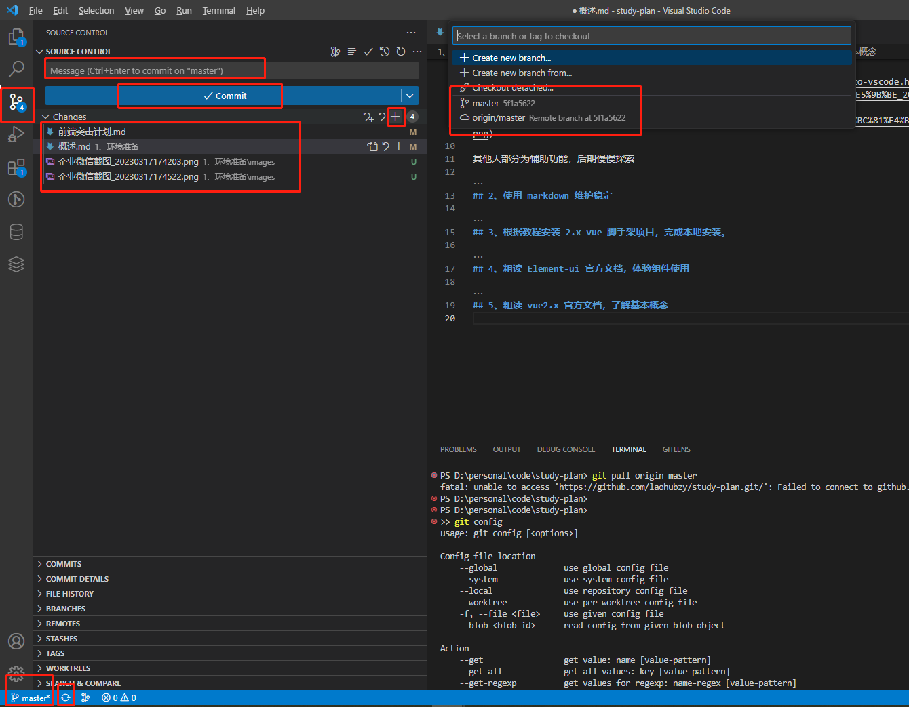
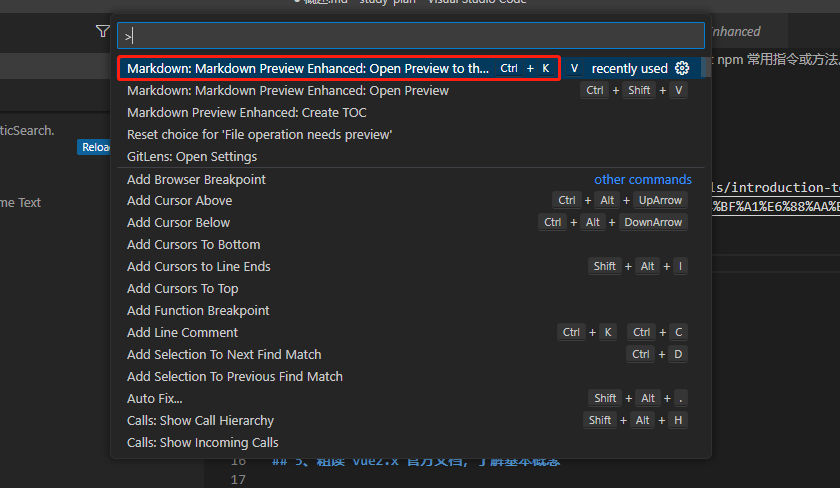

# 阶段一：环境准备 （2 天）

## 1、vscode git npm 常用指令或方法。

### vscode

[vscode 入门](https://geek-docs.com/vscode/vscode-tutorials/introduction-to-vscode.html)

**vscode 自带 git 功能 如下图。**

其他大部分为辅助功能，后期慢慢探索

### npm

npm 开源包管理工具官网: https://www.npmjs.com

package.json 最全详解: https://blog.csdn.net/qq_34703156/article/details/121401990

**重点**

- 区分 `npm install -D`（安装到开发环境 devDependencies） 和 `npm install -S`（安装到生产环境 dependencies） 区别
- 配置镜像(淘宝或者私有镜像) `npm set registry https://registry.npm.taobao.org`
- 看一个项目 从 `package.json` 的 `scripts`开始，这个是整个项目的入口
- 重点关注`package.json` 中的 `scripts`, `devDependencies）`, `dependencies`字段

### git

重点学会以下指令
git clone 克隆项目
git checkout 分支切换
git add 添加到缓存区
git commit 提交
git push 推分支
git pull 拉分支
git fetch 刷新分支
git reset 回退分支
git merge 合并分支

## 2、使用 markdown 维护稳定

markdown 语法 需要再去查，无需特地学习
https://www.jianshu.com/p/191d1e21f7ed/

`Markdown Preview Enhanced` markdown 预览 `Ctrl+Shift+P` 

## 3、根据教程安装 2.x vue 脚手架项目，完成本地安装。

1、使用脚手架创建 2.0demo 项目，注意是 2.0 版本
https://cli.vuejs.org/zh/guide/creating-a-project.html#%E6%8B%89%E5%8F%96-2-x-%E6%A8%A1%E6%9D%BF-%E6%97%A7%E7%89%88%E6%9C%AC

## 4、Chrome 常用调试

通读下文，自己体会
https://juejin.cn/post/6992388719894331422

## 5、粗读 Element-ui 官方文档，体验组件使用

Element-ui 组件官网： https://element.eleme.cn/#/zh-CN/component/installation
Element-ui 组件 github: https://github.com/ElemeFE/element

每个组件都体验一下

## 5、粗读 vue2.x 官方文档，了解基本概念

由于 vue 生态较大，官方文档通读很难 get 到重点。所以在第一阶段的通读，你只要知道，这些东西是什么，至于怎么用，后面学习源码时，将会详细讲解学习。
按照以下推荐顺序阅读：
[模板语法](https://vuejs.bootcss.com/guide/syntax.html)
[计算属性和侦听器](https://vuejs.bootcss.com/guide/computed.html)
[Class 与 Style 绑定](https://vuejs.bootcss.com/guide/class-and-style.html)
[条件渲染](https://vuejs.bootcss.com/guide/conditional.html)
[列表渲染](https://vuejs.bootcss.com/guide/list.html)
[事件处理](https://vuejs.bootcss.com/guide/events.html)
[表单输入绑定](https://vuejs.bootcss.com/guide/forms.html)
[组件基础](https://vuejs.bootcss.com/guide/components.html)
